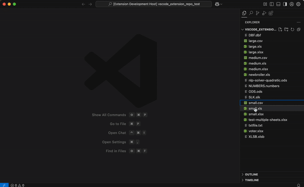

# SheetJS VSCode Extension

A simple VSCode extension that lets you view spreadsheets right in your editor. Works with XLSX, XLS, CSV, ODS and 30+ other formats.

## Key Features
The extension uses sophisticated optimization techniques to ensure smooth performance:

- **Multi-level Caching**
    - Workbook cache prevents redundant parsing of the same files
    - Sheet HTML cache eliminates regeneration of previously viewed sheets
- **Smart Loading Strategy**
    - First sheet loads immediately for instant feedback
    - Additional sheets load on-demand when selected
    - Preserved webview context maintains your state even when hidden
- **Responsive Interface**
    - Immediate loading spinner provides visual feedback
    - Sheet-switching indicators keep you informed
    - Persistent state across view changes

--- 

## Supported File Formats

| Supported File Formats |
| ---------------------- |
| *.xlsx                 |
| *.xlsm                 |
| *.xlsb                 |
| *.xls                  |
| *.xlw                  |
| *.xlr                  |
| *.numbers              |
| *.csv                  |
| *.dif                  |
| *.slk                  |
| *.sylk                 |
| *.prn                  |
| *.et                   |
| *.ods                  |
| *.fods                 |
| *.uos                  |
| *.dbf                  |
| *.wk1                  |
| *.wk3                  |
| *.wks                  |
| *.wk2                  |
| *.wk4                  |
| *.123                  |
| *.wq1                  |
| *.wq2                  |
| *.wb1                  |
| *.wb2                  |
| *.wb3                  |
| *.qpw                  |
| *.xlr                  |
| *.eth                  |       

## Getting Started
Want to integrate SheetJS in your own VSCode extension? Check out our [detailed tutorial](#) to learn how to implement these capabilities in your projects.

## Learn More
For more information on using this extension and integrating SheetJS capabilities in your own projects, visit our [documentation](https://docs.sheetjs.com/docs/).

---
_Created by Asadbek Karimov  | [asad@sheetjs.com](mailto:asad@sheetjs.com) | [asadk.dev](https://asadk.dev)_